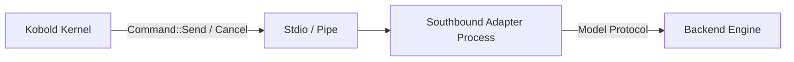

# Southbound Adapters Overview

A **Southbound Adapter** is an executable that bridges Kobold's `Command` stream to a specific provider, execution environment, or agentic runtime.

---

## The Adapter Contract

Every conforming adapter fulfills four rules:

1. **Exactly-Once Startup**:
   On launch, the adapter reads a single JSON line on stdin containing the [`Startup`](../architecture/seams.md#2-the-southbound-seam-kernel--adapter) frame (API keys, model configuration, and egress proxy address).
2. **Standard I/O Multiplexing**:
   Commands (`Send`, `ToolResult`, `Cancel`, `Quit`) arrive on `stdin`. Responses (`Event`, `Transport`) are emitted on `stdout` as single-line JSON.
3. **Graceful Subprocess Confinement**:
   Adapters run confined under macOS sandbox profiles or Linux namespaces, prohibiting unauthorized filesystem escape or credential sniffing.
4. **Lifecycle Independence**:
   When Kobold sends `Command::Quit` or closes `stdin`, the adapter terminates all child worker processes, PTYs, or subagents cleanly.

---

## Available Adapters

* **[`kobold-adapter-acp`](acp.md)**: Agent Client Protocol adapter for autonomous coding agents (Claude Code, Antigravity, Grok Build, OpenAI Codex, Meta Muse, OpenCode).
* **[`kobold-adapter-tmux`](tmux-pty.md)**: Headless PTY and Tmux session manager for persistent shell tasks and compiler loops.
* **[`kobold-openai`](openai.md)**: Native WebSocket streaming engine for the OpenAI Responses API with custom function calling and tools.
