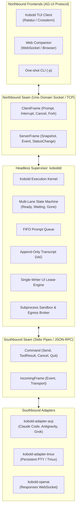

# System Architecture Overview

Kobold is structured as a decoupled, multi-tier system organized around a headless supervisor kernel and two standardized boundary seams.

---

## The Core Principles

1. **Strict Seam Isolation**:
   Frontends never talk directly to AI models, and adapters never know what terminal or browser is rendering output. The daemon bridges both sides using canonical types defined in `kobold-proto`.
2. **Headless & Detachable Execution**:
   The core execution state lives in the background daemon (`koboldd`). If the user closes their terminal or SSH connection drops, the agent continues executing without data loss. Reattaching is instantaneous.
3. **Single-Writer Lease Safety**:
   Only one UI frontend holds the read-write lease at any given time. Any additional clients attached to the same session are automatically downgraded to read-only follower mode, preventing concurrent state corruption.
4. **Zero Allocation on Render**:
   The terminal render path avoids memory allocation in steady-state loop iterations, yielding flat sub-25µs frame draw times.
